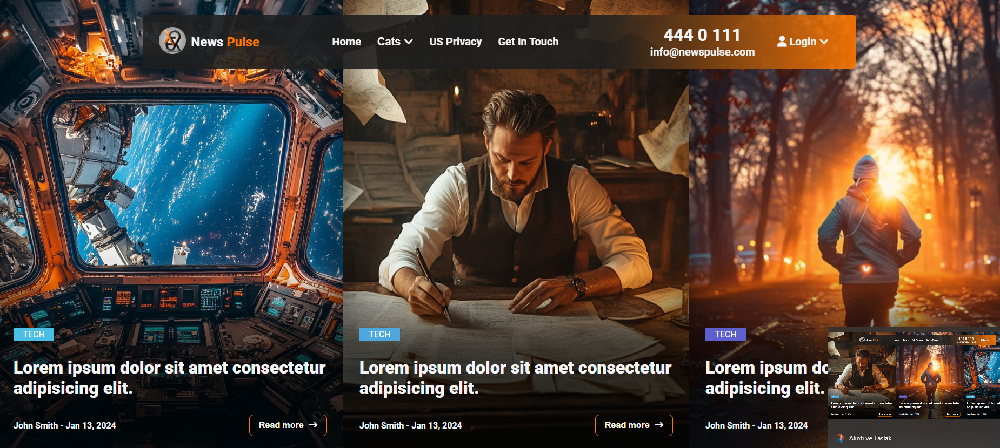
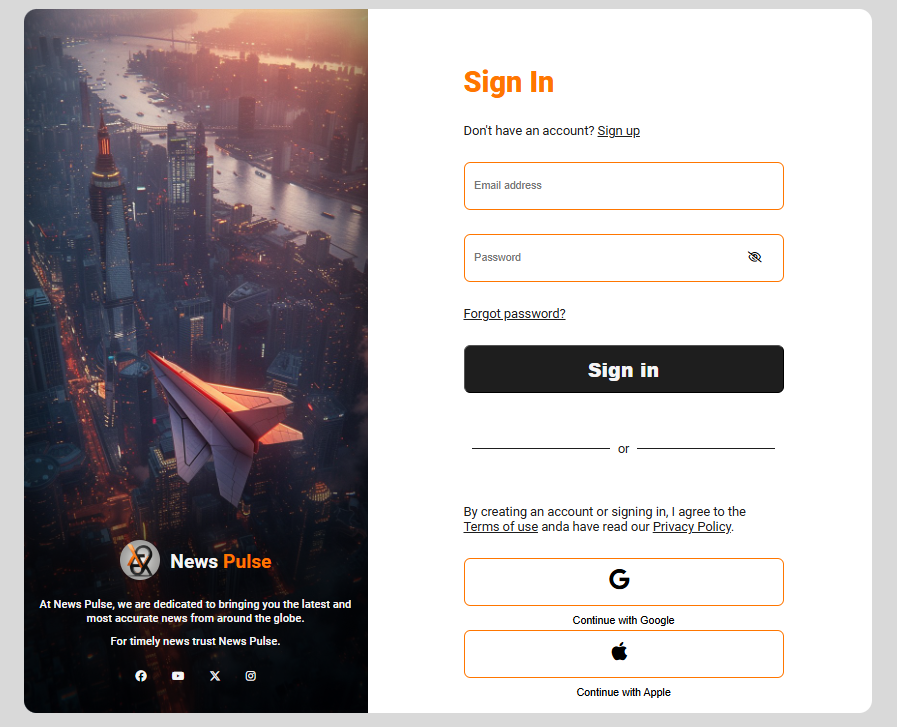
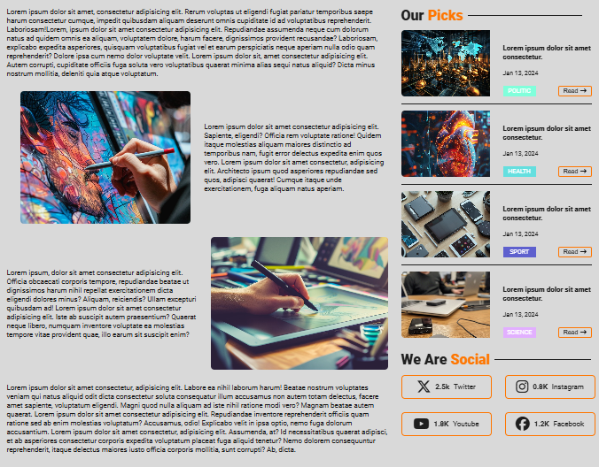
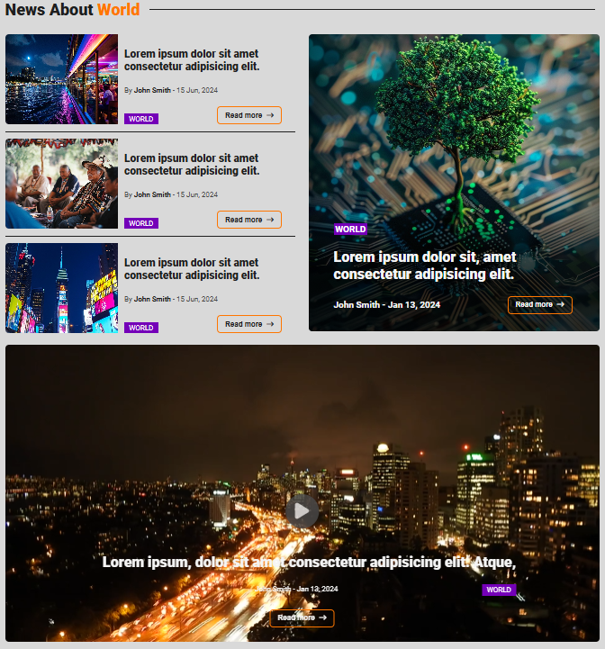

# Web Application Project: News Pulse Website
<br>
<div align="center">
    
    
    
    
</div>  

This project is a comprehensive news website that delivers the latest headlines and updates from various sources. It features a user-friendly interface with advanced functionality for a seamless news browsing experience.
<br>
**Preview:** You can view the demo video [here](https://drive.google.com/file/d/1QPXqEVoTbTJHo7oSpUMgjQ8tSK0GLWUn/view?usp=sharing).


## Features

### Frontend

- **Latest Headlines:** View the most recent news headlines across different categories.
- **Search Functionality:** Quickly search for specific news topics or keywords.
- **Article Details:** Read full articles with images and detailed content.
- **Comment System:** Users can leave comments on articles and view others' comments.
- **User Authentication:** Sign up, log in, and manage user accounts.
- **Responsive Design:** Optimized for a smooth experience on desktops, tablets, and mobile devices.
- **Modern UI/UX**: Clean and intuitive design for an enhanced user experience.
- **Advanced Search Functionality**: Allows users to search for properties by various criteria such as location, price range, and property type.
- **Animation Effects**: Smooth animations for transitions and interactive elements, enhancing the visual appeal and user engagement.
- **Form Validation**: Ensures that user input is valid before submission.


## Installation

### Clone the Repository

To get started with the project, clone the repository using the following command:

```bash
git clone https://github.com/OneSideMoon/news-pulse
```

### Navigate to the Project Directory

Once you have cloned the repository, navigate to the project directory using the following command:

```bash
cd news-pulse
```

### Open the Project

To view the application, open the `index.html, login.html, news.html, world.html` files in your web browser. You can do this by either double-clicking the file in your file explorer or using a local server setup.


## Technologies Used

- **HTML**: Provides the structure and content of the web application.
- **CSS**: Handles styling and layout, including responsive design.
- **JavaScript**: Adds interactive features and animations to enhance user experience.
- **Swiper.js:** Provides interactive and animated banners for showcasing news and promotions.


## Contributing

I welcome feedback and contributions. If you have suggestions or fixes, please feel free to open a pull request or create an issue.


## Contact

If you have any questions or would like to get in touch with me, you can reach me through the following channels:
- [LinkedIn](https://www.linkedin.com/in/muhammet-batuhan-sahin-965b81216/)
- [Instagram](https://www.instagram.com/one.side.moon/)
- [Email](mailto:batuhansahin9040@gmail.com)


## License

This project is licensed under the [MIT License](https://github.com/OneSideMoon/frontend-mentor-challenge/blob/main/LICENSE).
